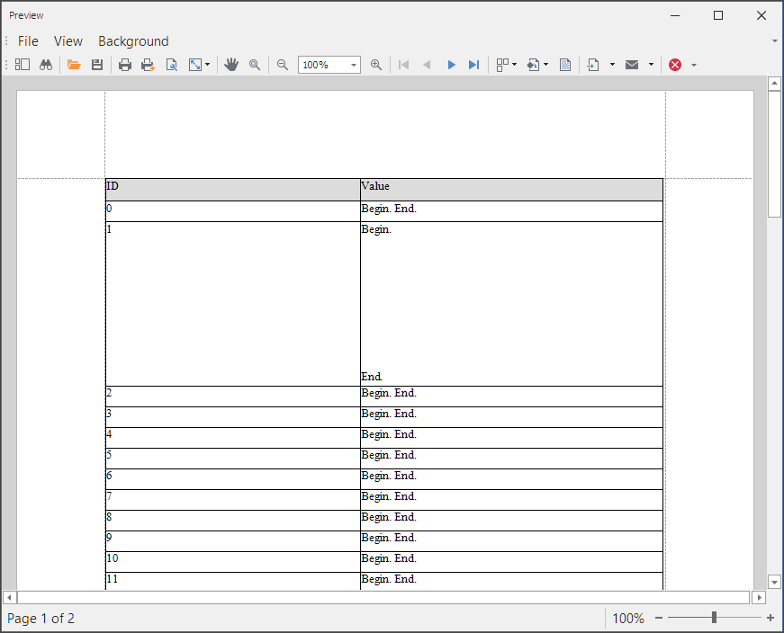

<!-- default badges list -->

<!-- default badges end -->
# Reporting for WinForms - How to Adjust the Row Height to Best Fit the Cell Content

This example sets the [XRTable.Height]() property at runtime to the value that allows the table to display the entire cell content.

## Files to Review

* [Form1.cs](./CS/dx_sample/Form1.cs) (VB: [Form1.vb](./VB/dx_sample/Form1.vb))
* [XtraReport1.cs](./CS/dx_sample/XtraReport1.cs) (VB: [XtraReport1.vb](./VB/dx_sample/XtraReport1.vb))

## Documentation
- [XRTable](https://docs.devexpress.com/XtraReports/DevExpress.XtraReports.UI.XRTable)
- [Use Tables](https://docs.devexpress.com/XtraReports/9741/detailed-guide-to-devexpress-reporting/use-report-controls/use-tables)
- [Hide Table Cells](https://docs.devexpress.com/XtraReports/120028/detailed-guide-to-devexpress-reporting/use-report-controls/use-tables/hide-table-cells)

## More Examples

- [Table Report - How to Adjust the Column Width to Best Fit the Cell Content](https://github.com/DevExpress-Examples/reporting-winforms-best-fit-table-column-width)
